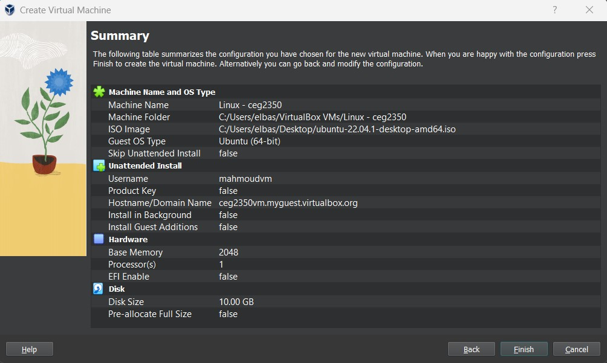
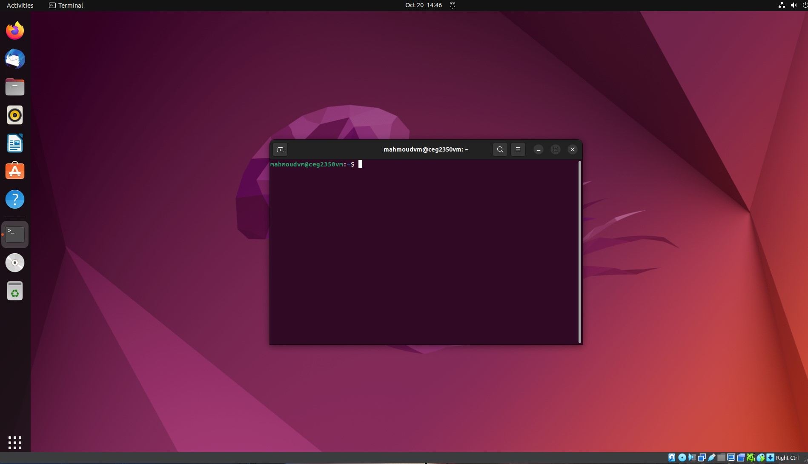

## Lab 07

- Name: Mahmoud Elbasiouny
- Email: elbasiouny.2@wright.edu

## Part 1 Answers

1. Steps to configure virtual hardware:
    - While setting up the VM, under "Hardware" ensure that "Base Memory" is set to 2048 MB (2 GB)
    - Under "Virtual Hard disk" ensure that "Disk Size" is set to 10 GB
3. Screenshot of VM settings:
   
4. Steps to download an ISO:
    - I chose Ubuntu Desktop for my ISO
    - Go to https://ubuntu.com/download
    - Click on Ubuntu Desktop link and click the green download button
5. Steps to use ISO on VM:
    - When creating a new VM, select the dropdown under "ISO Image" and locate the downloaded ISO file
6. Steps to install your distribution:
    - During first launch, click "Try or Install Ubuntu"
    - I had to change the disk size from 10 GB to 25 GB in order for installation to work
7. Steps to boot to disk after install:
    - At the top of the VM window click "Devices", then "Optical Drives", and select the .iso file
    - Once selected, click the "Remove disk from virtual drive" option at the bottom and click "Force Unmount"
8. Steps to use full screen mode:
    - Download the VirtualBox Extension Pack from https://www.virtualbox.org/wiki/Downloads
    - In the VirtualBox Manager window, click the three lines next to "Tools" and click "Extensions"
    - Click "Install" and locate the downloaded file
    - In the VM, click "Devices" at the top and click "Insert Guest Additions CD image"
    - Open the CD folder and run the Linux installer
    
9. Screenshot of VM running:

## Part 2 Answers

1. Steps to change desktop background.
    - Right click on desktop and choose "Change background" option
    - Choose image that you would like as your background
2. Steps to open a web browser.
    - Click "Activities" in the top left corner
    - Search "firefox" and click to open
3. Steps to install VSCode.
    - Open the terminal by clicking "Activites" in the top left corner and searching terminal
    - Type `sudo snap install --classic code` (user will need to be added to the sudoers group first)
4. Steps to connect to your AWS instance from your VM.
    - Copy the `config` file and `ceg2350key` (private ssh key) into the `.ssh` folder in the VM user's home directory
    - Ensure that the permissions of the private key file are secure (only user should have read permissions)
